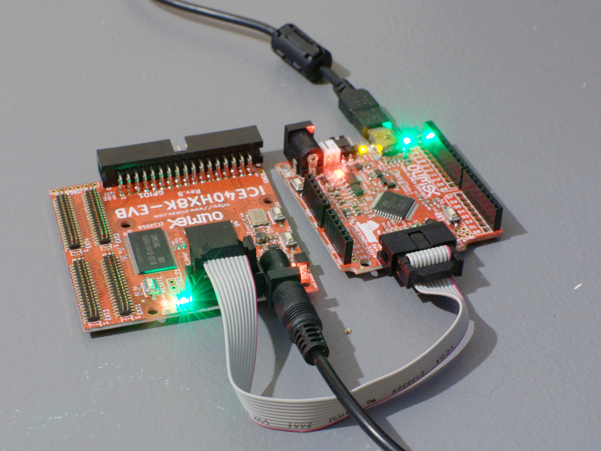
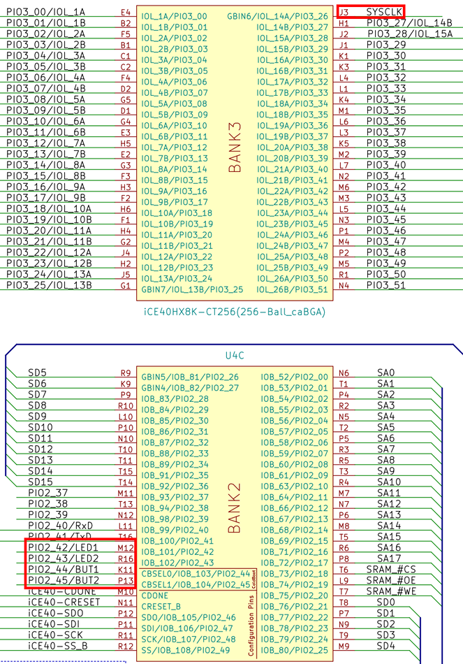

((title . "Let the adventure begin!")
 (date . 1503569173)
 (abstract . "I just received an FPGA evaluation board")
 (translated . #f))

Yesterday I received my very first FPGA evaluation board from Olimex!

It’s based on the Lattice iCE40HX8K chip, that’s the biggest (most available IO and logic cells) FPGA that is supported by [icestorm][1], an open-source tool-chain for this family of FPGAs!

As per Olimex’s documentation I also got their Olimexino 32U4, an Arduino clone. It’s used to send the design to the FPGA. You don’t really need one if you already have something to write an SPI flash or talk to the FPGA via the JTAG port, but that wasn’t my case. All the procedure is explained on the [Olimex wiki][2]

The first thing I did was to grab [some example code][3] to test my setup, this code just makes the LEDs on the FPGA board blink. Think of it as the electronics “Hello world!”. :D

I installed the icestorm tool-chain from my distribution’s packages and built the project, no problem there. Though, when I tried to upload the code to the board, it seemed to take a very long time… After a couple of minutes I stopped it, as it shouldn’t take that much time to send a few kilobytes via a serial connection. It turn out I forgot to supply power to the FPGA board! What lead me to this error was that one of the LED (CDone) on the FPGA was lighted up, apparently the programmer supplies enough power to turn that on, but that’s all.

Once that was fixed, the programming only took a couple of seconds to complete the transfer.

Interestingly, the code did… nothing. No LED was blinking and the only button that did anything was the reset button.

I then looked at the code a bit, and indeed it would not work, the makefile tells the compiler that I’m using the HX**1**K FPGA, which has different pins and logic cells mappings. I went ahead and changed that (from hx1k to hx8k), as well as the package (from vq100 to ct256).

With these changes the compilation worked, but the router (arachne-pnr) yelled at me for using undefined pins! Indeed I forgot to change the file indicating to which pins (or balls in this case) the different components of the board are connected to, which are very different from one package to the next.

In order to do that, I downloaded the [board schematics][4] and found which pin corresponded to the clock, LEDs and buttons.

Here is the resulting pcf file:

    set_io CLK J3
    set_io BUT1 K11
    set_io BUT2 P13
    set_io LED1 M12
    set_io LED2 R16

With this done, the whole compilation process worked, I uploaded the design and… hurray! The LEDs are blinking!

<video style="width:100%" controls="controls">
<source src="../../resources/post-5/LEDs-blinking.mp4" type="video/mp4"></source>
Video of the LEDs blinking
</video>

I did the exact same dance for the the VGA example code available in the Olimex repository, though I had to use the schematics of the VGA add-on as well, and it worked just as well as the previous one! :D

<video style="width:100%" controls="controls">
<source src="../../resources/post-5/VGA-demo.mp4" type="video/mp4"></source>
Video of the VGA demo
</video>

Of course I sent my modifications to the Olimex repository. As a [pull request][5] on github.

Now I have all I need to experiment with many things I’m curious about, like CPU and GPU design, interfacing with various hardware pieces (like the Gameboy) and many other things!

[1]: http://www.clifford.at/icestorm/
[2]: https://www.olimex.com/wiki/ICE40HX1K-EVB#Get_started_under_Linux
[3]: https://github.com/OLIMEX/iCE40HX1K-EVB/tree/master/demo/ice40hx1k-evb
[4]: https://github.com/OLIMEX/iCE40HX8K-EVB/raw/master/HARDWARE/REV-B/iCE40HX8K-EVB_Rev_B.pdf
[5]: https://github.com/OLIMEX/iCE40HX8K-EVB/pull/1
